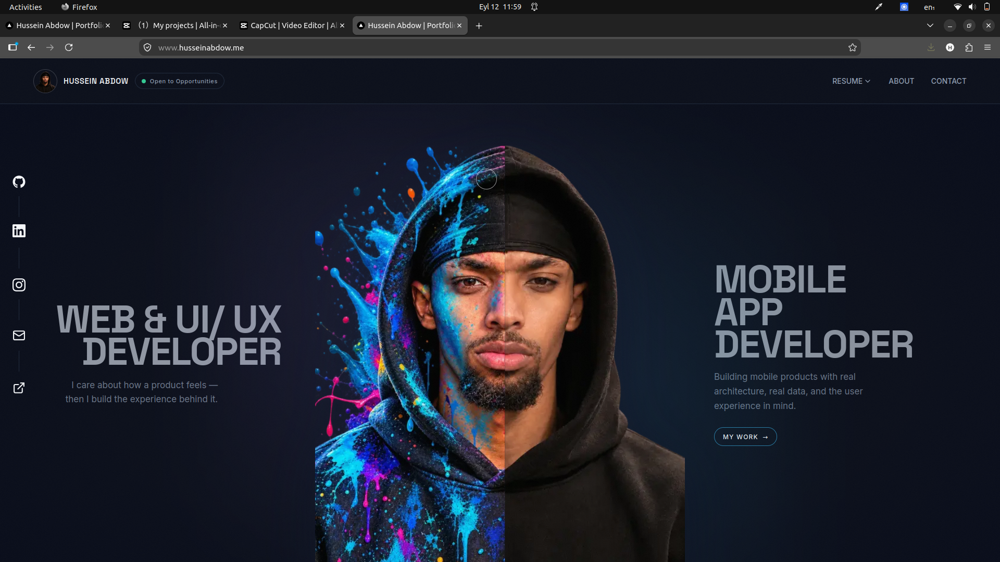
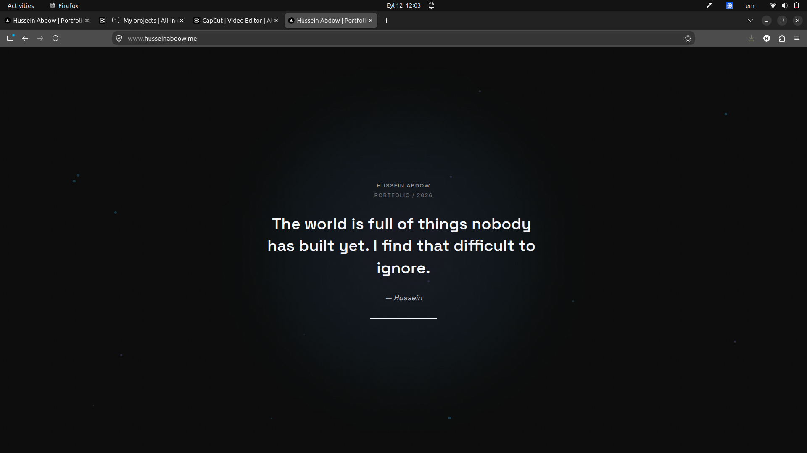
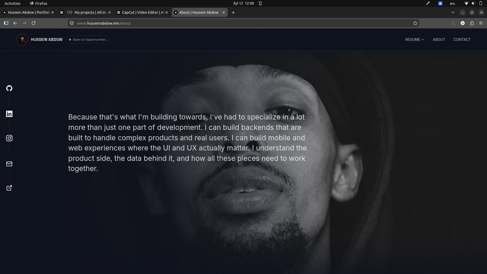
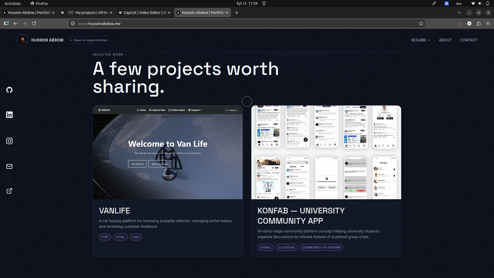
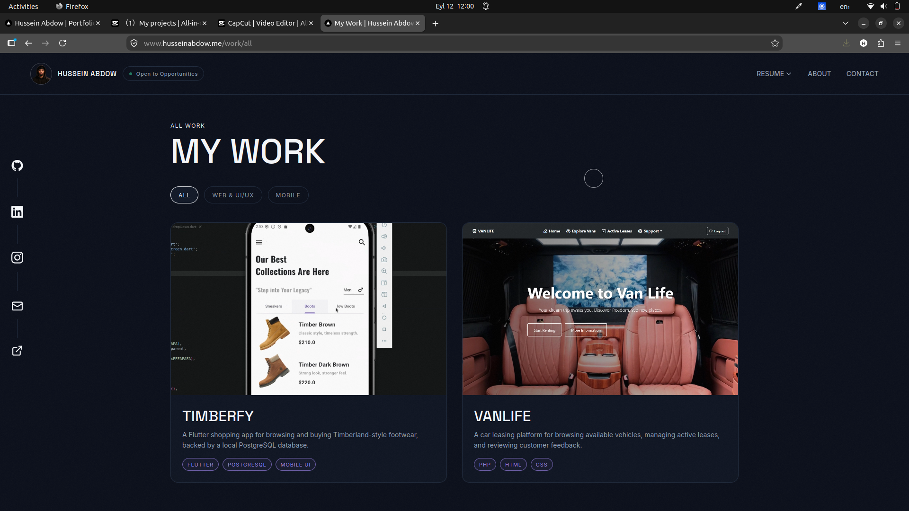
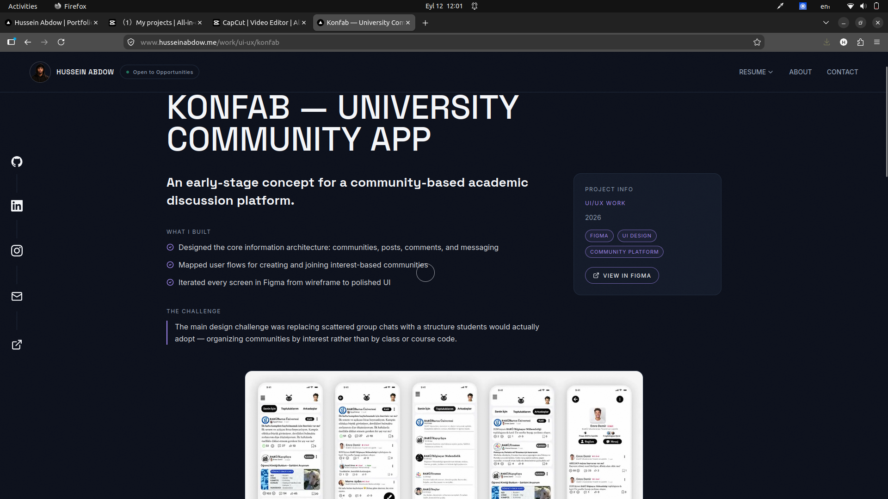
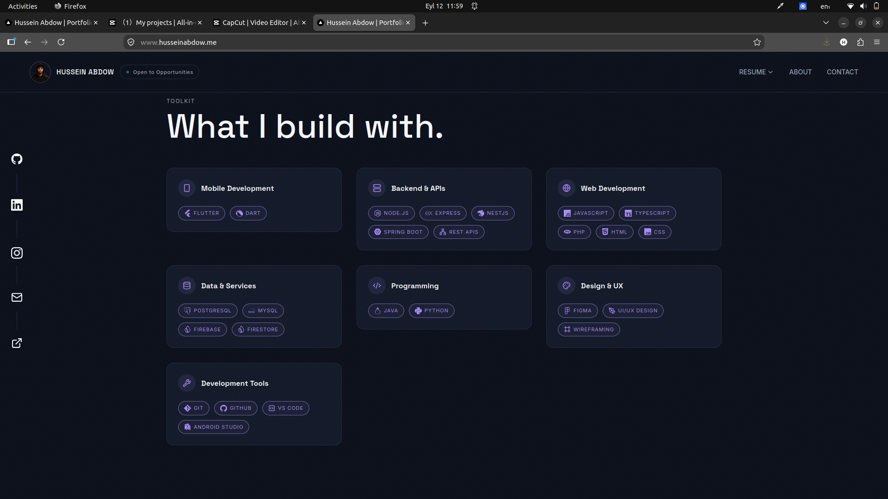
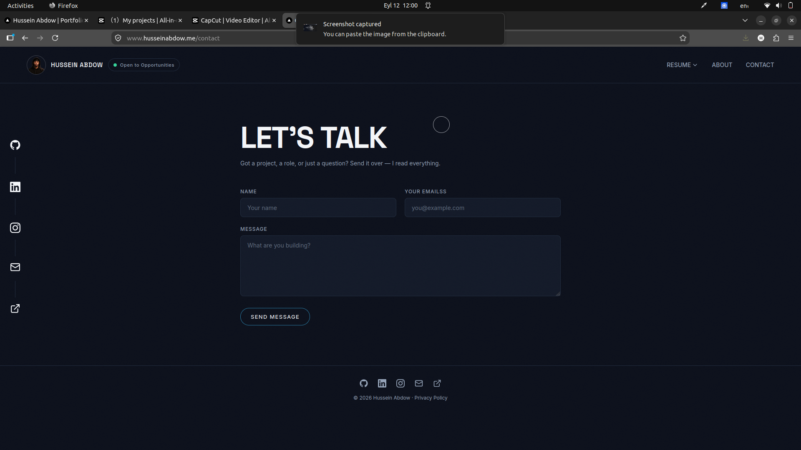
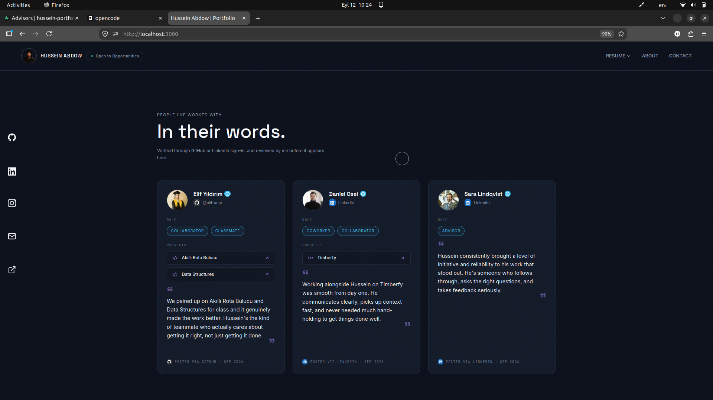

# Hussein Abdow — Developer Portfolio

A personal portfolio showcasing web/UI-UX development and mobile app development work — fast, animated, and built with real architecture behind every feature.


**Live site:** [https://husseinabdow.me](https://husseinabdow.me)

## Screenshots

| | |
|---|---|
|  |  |
| *Landing page with cursor-driven split-portrait hero* | *Intro quote reveal before the page lands* |
|  |  |
| *About section* | *Selected work — case studies in a grid* |
|  |  |
| *Categorized work pages* | *Project detail page with gallery* |
|  |  |
| *Toolkit / tech stack section* | *Contact page with working email form* |
|  | |
| *"In their words" — verified testimonial wall* | |

## Overview

This is my personal portfolio — not a template. It presents my web, UI/UX, and mobile work through categorized case studies with per-project galleries, an animated cursor-driven hero, and an interactive "A Few Words" wall where real visitors can leave verified messages. Everything on the site is backed by working server-side code: OAuth sign-in, submission moderation, and email delivery.

## Features

- **Cursor-driven split-portrait hero** — the center portrait reacts to cursor position on desktop (left/right blend), with a dedicated responsive fallback on mobile
- **Categorized project showcase** — work is split into website, mobile, and UI/UX category pages, each with its own gallery layout, plus per-project detail pages with image galleries
- **"A Few Words" community wall** — visitors sign in via GitHub or LinkedIn OAuth (Supabase Auth) to leave a message, tag up to two relationships (Coworker, Collaborator, Classmate, …) and any collaborative projects; submissions are moderated (approve/reject) through a private admin page before appearing publicly, and users can edit their own active submission
- **Resume access** — browser-viewable PDF from the navbar, with a dropdown offering PDF and DOCX downloads
- **Contact form** — server-side validation (name, valid email, message, plus a honeypot field) with delivery via Resend from a verified domain identity
- **Custom domain** — deployed with husseinabdow.me

## Tech Stack

| Layer | Technologies |
|---|---|
| Frontend | Next.js 14 (App Router), React 18, TypeScript 5, Tailwind CSS 3, Framer Motion, Lucide + React Icons |
| Backend & Auth | Supabase (`@supabase/supabase-js`, `@supabase/ssr`) — Postgres with RLS, GitHub & LinkedIn OAuth, service-role server client |
| Email | Resend |
| Image processing | Sharp (next/image optimization) |
| Validation | Zod (submission payload validation) |

## Project Structure

```
app/                  # App Router pages + API routes (auth, words, contact)
components/           # UI components (hero, work, words wall, contact, etc.)
lib/                  # Supabase clients, validation schemas, project data, helpers
supabase/migrations/  # SQL schema migrations for the words_submissions table
public/               # Static assets (resume PDF/DOCX, images, work media)
images/               # Source images (portrait assets, README screenshots)
```

## Getting Started

```bash
git clone https://github.com/HusseinAbdow/hussein-portfolio.git
cd hussein-portfolio
npm install
cp .env.example .env.local   # fill in the variables below
npm run dev
```

Open [http://localhost:3000](http://localhost:3000).

## Environment Variables

| Variable | Purpose |
|---|---|
| `NEXT_PUBLIC_SUPABASE_URL` | Supabase project URL — safe for the browser |
| `NEXT_PUBLIC_SUPABASE_ANON_KEY` | Public anon key used by the browser client |
| `SUPABASE_SERVICE_ROLE_KEY` | Server-only Supabase key for API routes — bypasses RLS, never exposed to the client |
| `ADMIN_GITHUB_USER_ID` | Your numeric GitHub user ID — gates the admin moderation flow |
| `RESEND_API_KEY` | Resend API key — sends contact-form and submission-notification emails |

## Contact

- **Portfolio:** [https://husseinabdow.me/contact](https://husseinabdow.me/contact)
- **GitHub:** [github.com/HusseinAbdow](https://github.com/HusseinAbdow)
- **LinkedIn:** [linkedin.com/in/husseinabdow](https://linkedin.com/in/husseinabdow)
